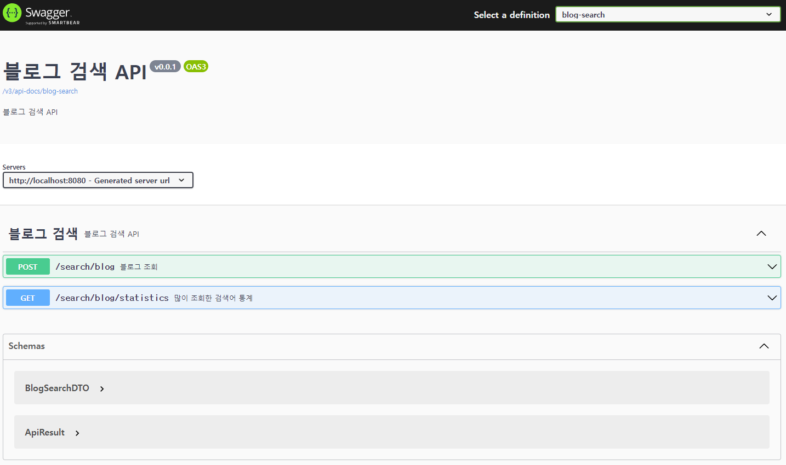

## 프로젝트 설명
### - 구조
1. 이력 테이블 (blog_search_history)과 통계용 테이블 (blog_search_cnt) 두개
2. 블로그 검색을 하게되면 검색 결과를 리턴하고, 이력 테이블에 저장
3. 주기적인 스케쥴러를 활용해서 이력 데이터 통계를 10초 마다 통계 테이블에 저장
4. 검색횟수 많은 순으로 최대 열개의 통계 데이터 조회
### - 테이블
#### blog_search_history
|**컬럼명**|**설명**|
|:---:|:---:|
|seq|PK|
|source|출처 (K:카카오,N:네이버)|
|query|검색어|
|reg_dttm|검색시간|
#### blog_search_cnt
|**컬럼명**|**설명**|
|:---:|:---:|
|query|검색어|
|cnt|검색횟수|
### - 스웨거
